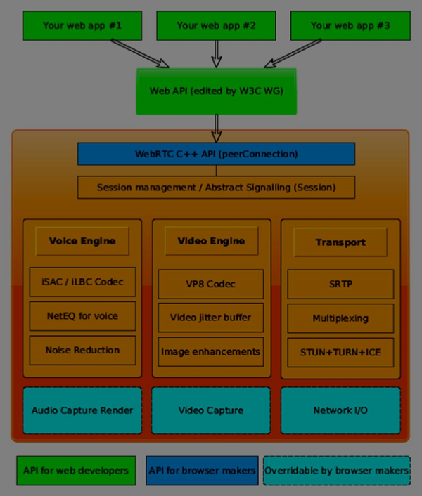

# WebRTC

Concepts on WebRTC

## Codecs

Codecs are compression technologies that have 2 components:

- Encoders to compress
- Decoders to decompress

There are codecs for different types of streams:

- Data (PKZIP)
- Images (JPEG, GIF, PNG)
- Audio (MP3, AAC)
- Video (Cinepack, MPEG-2, H.264, VP8)

There are 2 kinds of Codecs:

- lossy
- lossless

Lossless codecs return the exact same file after decompression.
Lossy codecs would cause a lose of quality after decompression. Intra frame is more effecient than interframe, hence most codecs are designed to look out for redundancies.

Most codecs today use I-frame, P-frame and B-frames.

Containers are not the same as codecs. Codec is an algorithm used for compression and decompresion while containers hold the compressed video. Containers take care of packaging, transport and presentation and are represented by file extensions.

Most codecs today on the web are H.264

## Basic scheme of WebRTC

1. Media capture - get permission from user to access the devices and manage the streams
2. Encoding - use of codecs to compress/decompress media while sending them over the internet
3. Transport layer - manages the order of packets and deal with packet loss
4. Session management - deals with managing, opening and organizing connections. Also known as signaling.

## WebRTC architecture



## WebRTC API

1. RTCPeerConnection
2. MediaStream
3. RTCDataChannel

`RTCPeerConnection` object is the main entry point to the WebRTC API. It connects us to peers, initialize connections and attach media streams. It's main task is to set up and create a peer connection. This object fires a set of events as they appear and gives us access to the configuration of our connection.

To create,

```
var conn = new RTCPeerConnection(conf);

conn.onaddstream = function(stream) {
   // use stream here
};
```

`onaddstream` is fired when remote user adds a video or audio stream to their peer connection.
